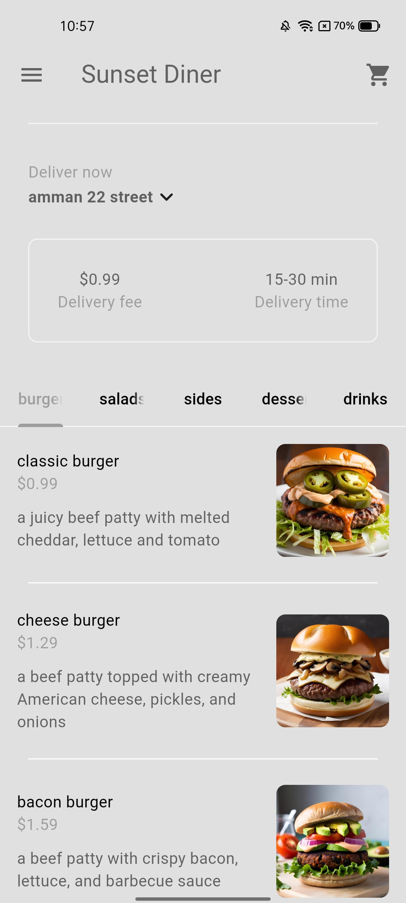

# 🍔 Food Delivery App

A Flutter mobile application for food delivery services. This app allows users to browse, order, and pay for food from various restaurants.


## 📱 Features

- User authentication with Firebase Auth
- Browse food by categories (burgers, sides, salads, drinks, desserts)
- Add items to cart
- Checkout process with payment information
- Order tracking
- User profile management
- Dark/Light theme support

## 🛠️ Technologies

- Flutter & Dart
- Firebase (Authentication, Firestore)
- Provider for state management
- Flutter Credit Card for payment UI

## 📋 Prerequisites

Before you begin, ensure you have the following installed:
- [Flutter](https://flutter.dev/docs/get-started/install) (version 3.7.0+)
- [Dart](https://dart.dev/get-dart) (version 3.0.0+)
- [Git](https://git-scm.com/)
- [Firebase CLI](https://firebase.google.com/docs/cli) (for Firebase configuration)

## 🚀 Installation

1. Clone the repository
   ```bash
   git clone https://github.com/yourusername/deliveryapp.git
   cd deliveryapp
   ```

2. Install dependencies
   ```bash
   flutter pub get
   ```

3. Configure Firebase
   - Create a Firebase project in the [Firebase Console](https://console.firebase.google.com/)
   - Enable Authentication and Firestore
   - Download your Firebase configuration files for each platform (google-services.json for Android, GoogleService-Info.plist for iOS)
   - Place the configuration files in their respective directories:
     - Android: `android/app/`
     - iOS: `ios/Runner/`

4. Run the app
   ```bash
   flutter run
   ```

## 📝 Usage

1. Register or log in to the app
2. Browse through food categories
3. Add items to your cart
4. Proceed to checkout and provide delivery details
5. Review your order and make payment
6. Track your delivery status

## 🧪 Running Tests

```bash
flutter test
```

## 📷 Screenshots

<h2>📸 Screenshots</h2>
<p>
  
  
  
</p>
<p>
  
  
  
</p>
<p>
  
  
  
</p>


## 🤝 Contributing

Contributions are welcome! Please feel free to submit a Pull Request.

1. Fork the project
2. Create your feature branch (`git checkout -b feature/amazing-feature`)
3. Commit your changes (`git commit -m 'Add some amazing feature'`)
4. Push to the branch (`git push origin feature/amazing-feature`)
5. Open a Pull Request

## 📄 License

This project is licensed under the MIT License - see the LICENSE file for details.

## 📞 Contact

 [Belal salah]    - belalabukhadija97@gmail.com

